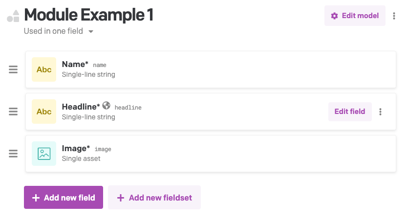
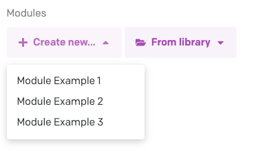
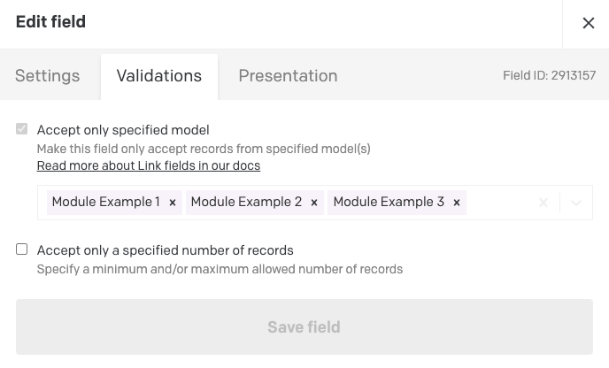
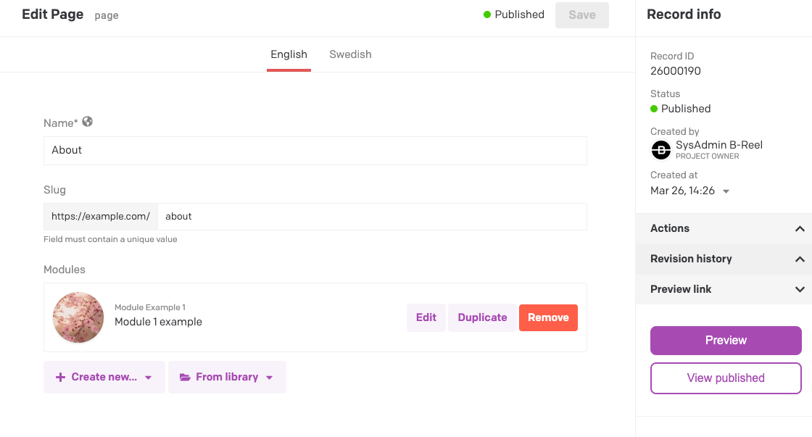
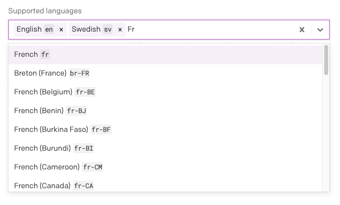

# DatoCMS / Next.js boilerplate

## Motivation
This template's goal is to facilitate the creation of new projects using both [Next.js](https://nextjs.org/) and [DatoCMS](https://www.datocms.com/).

Once fully setup, you'll be able to easily create new pages and add modules entirely managed by a powerful headless CMS. The modular approach is heavily inpsired by Brad Frost's [Atomic Design](https://bradfrost.com/blog/post/atomic-web-design/).
## Architecture

- TypeScript
- Next.js
- React
- Redux/rematch
- GraphQL
- PostCSS/CSS Modules
## Features
- Type check & eslint
- Dynamic page creation (via DatoCMS)
- Atomic design approach (via DatoCMS)
- Internationalization
- Preview mode (draft/published models)


## How to use
### 1. Clone DatoCMS Project
Create a DatoCMS account and simply clone the base [DatoCMS template](https://dashboard.datocms.com/clone?projectId=45226&name=B-Reel+Next.js%2FDatoCMS+boilerplate) 
### 2. Set up environment variables
In your DatoCMS' project, go to the *Settings* menu at the top and click *API tokens*. Then click *Read-only API token* and copy the token.
Copy the `.env.local.example` file in this directory to `.env.local` (which will be ignored by Git):

```bash
cp .env.local.example .env.local
```

Then set each variable on `.env`:
- `DATOCMS_API_TOKEN` should be the API token you just copied.
- `DATOCMS_PREVIEW_SECRET` can be any random string (no spaces), like `MY_SECRET` - [used for the Preview Mode](https://www.datocms.com/docs/next-js/setting-up-next-js-preview-mode).

Your `.env.local` file should look like this:
```bash
DATOCMS_API_TOKEN=...
DATOCMS_PREVIEW_SECRET=...
API_URL=https://graphql.datocms.com/
```

### 3. Install and run the project locally

```bash
npm install
npm run dev
```

If using Vercel as a hosting solution, make sure to install it as well
```bash
npm install -g vercel
```

### 4. Build the project
**SSG/SSR hybrid**
```bash
npm run build
npm run start
```
**SSG only**
```bash
npm run export
```
*Note that both i18n and fallback pages (located in /src/pages/[[...slug]]) aren't yet compatible with `next export`.*

## Pages logic
### Dynamic pages
A dynamic pages is mostly handled by DatoCMS and is composed of: 
 - Name 
 - Slug
 - Modules

The *Name*'s first purpose is to be used to generate the page's title.
The *Slug* is used to generate a unique URL for the created page.
Finally, the *Modules* will compose the page itself. You can see modules as an empty component that will be using the content provided in DatoCMS. When first cloning this project, you'll only be able to add a few modules to your page, but you can easily create new ones (see *Modules* section below).
All dynamic pages will be listed under DatoCMS' *Pages* section.

Most of the dynamic pages' logic will be located in the `/src/pages/[[...slug]].tsx` file.
The `getStaticPaths` method allows for Next.js to generate all the routes when running `npm run build`, while the
`getStaticProps` method queries all the data required for the page to be built. The rest of this function component will simply create the page squeleton and inject the created modules into it. 
### Static pages
There are occurences when you won't want a modules based page (e.g. a custom page layout that isn't used anywhere else on the website). You can simply create an empty page using DatoCMS and give it a *slug* that starts with `/static/` followed by whatever folder you want to target in your Next.js project. To prevent conflicts with the dynamic pages, all the static pages should be location inside the `/src/pages/static/` directory. 
### Routing
Note that creating a page doesn't mean that it'll appear in the nav, it'll only generate a new route for said page. If you want the page to appear in the nav (at least, using the current code architecture), go to your DatoCMS project, click *Content* on the upper left and then *Global*, finally, add the created page inside the *Main Navigation* list.
## Modules
Pages are the highest level of encapsulation. Modules are what the page is made of.
Imagine a Homepage with the following structure: 
| Header          |
|:---------------:|
| Hero section    |
| Carousel        |
| Story component |
| Simple text     |
| Form            |

Each *Hero section*, *Carousel*, *Story component*, *Simple text* and *Form* is a predefined module. Please see below to find out how to create and implement a new module.
### 1. Create a new CMS model 
For each of these modules, we first create a model in DatoCMS (to define it's data architecture) via different fields that'll allow an editor to easily create a new instance of said module and add content to it.
As an example, here's the *Module Example 1* created for this demo's purpose:



You can easily create a new module and add as many fields as you'd like by going into your DatoCMS project, then click *Models* inside the top bar, then *Models* and finally the + sign down at the bottom. Ideally, you'd first provide a *Name* (as pictured on the example above) in order for the DatoCMS' editors to be able to easily find each module they created. The rest is up to you and will depend of the complexity of the module you're trying to implement. 
### 2. Link new module to pages' model
When going back to the *Content* section of DatoCMS and inside the *Pages* sidebar, you'll be able to create/edit a page. Note that all modules' models have to be linked to the *Page*s' models in order to be available. By default, the modules section of a page will look like this:



To link a newly created *Module*'s model (yes it's confusing at first), go back to DatoCMS' model section (as described in step 1) and click the *Page* model, then in the *Modules* list, click *Edit field*, and *Validation*



Make sure the *Accept only specified model* lists your newly created *Module*. When it's added, save and go back to the *Page*s content section in which you'll now be able to add your new module (and inject content to it).

### 3. Create GraphQL query
So far so good, we now have everything ready in DatoCMS to add/edit modules onto a page. Next step is to create the GraphQL query that allow the Next.js build to get the newly created module's data. To do so, add a new fragment inside `/src/lib/api-fragments.ts`, it's not rocket science, so just use the existing examples as a guide:
```javascript
export const moduleExample2Fragment = `
  ... on ModuleExample2Record {
    ${MODULE_BASE_FRAGMENT}
    ctaLabel
    ctaUrl
  }
`;
```
Make sure you export said fragment, now go into `/src/lib/api.ts` file, import the newly created fragment and add it inside the `dynamicPageBySlugQuery` method below the `modules` list as done for the other examples:
```javascript

import {
  RESPONSIVE_IMAGE_FRAGMENT,
  META_TAGS_FRAGMENT,
  moduleExample1Fragment,
  moduleExample2Fragment,
  moduleExample3Fragment,
} from './api-fragments';

...

export function dynamicPageBySlugQuery(): string {
  return `
    query PagesBySlug($locale: SiteLocale, $slug: String) {
      page(locale: $locale, filter: {slug: {eq: $slug}}) {
        id
        slug
        name
        seo: _seoMetaTags {
          ${META_TAGS_FRAGMENT}
        }
        modules {
          ${moduleExample1Fragment}
          ${moduleExample2Fragment}
          ${moduleExample3Fragment}
        }
      }
    }
    ${RESPONSIVE_IMAGE_FRAGMENT}
  `;
}
```
### 4. Create React component
Almost there! The final step is to create the React component inside `/src/components/modules/...` (so you keep it clean). Once that's done, import the module inside `/src/components/modules-container/index.tsx` and edit the switch's logic, so the code can deal with your newly created module.
```javascript
switch (module.type) {
  case 'module_example1':
    component = <ModuleExample1 {...module} />;
    break;
  case 'module_example2':
    component = <ModuleExample2 {...module} />;
    break;
  case 'module_example3':
    component = <ModuleExample3 {...module} />;
    break;
  default:
    component = <div />;
    break;
}

```
Note that we spread the module object like so `{...module}`, so all the data created via DatoCMS (if correctly fetched via GraphQL) will be available inside your module's `.tsx` file.

That's it, voilà.

## Live previews
Editing content needs to be fast and intuitive. To make it this way, you can easily add live previews to your project (for this, use Vercel/Netlify to host your project).

First, you may want to check Next.js [official doc](https://nextjs.org/docs/advanced-features/preview-mode) as well as [DatoCMS's one](https://www.datocms.com/blog/live-preview-with-next-js). 

If you actually click that DatoCMS link and read it, you must think it's going to take hours to setup the live preview. Thankfully, that work has already been done. Make sure your project has the [Next.js preview plugin](https://github.com/wbobeirne/datocms-plugin-nextjs-preview) installed. Set the *Preview API path* to `/api/preview` and the *Preview secret* to `MY_LITTLE_SECRET`. Make sure you edit the `DATOCMS_PREVIEW_SECRET` environment variable so you use the same value on all your environments (local as well as whatever you have on Netlify/Vercel). 

Now head over to the *Content* section of DatoCMS, then click on the *Pages*, open one of the page and open the sidebar on the right and click the *Preview* button:



You should now have a new window with the preview mode enabled (via cookies) and every DatoCMS update will be automatically displayed (within a few seconds usually) as you save them. To exit the preview mode, just click on the button in the header.
## i18n
We're not done! If needed, you can easily implement new locales on your project. Here's how to do it:

### DatoCMS
Open DatoCMS' settings and click settings again (yes, another setting button inside a Settings section, that's weird), inside *Supported language* add whatever locale you'd like to use:



### Next config
Edit `next.config.js` file and add (or edit if it already exists) the object `i18n` with all the locales defined like so: 
```javascript
i18n: {
  locales: ['en', 'sv'],
  defaultLocale: 'en',
}
```
For more informations about i18n and Next.js, check the [official doc](https://nextjs.org/docs/advanced-features/i18n-routing)

If you followed all the steps above, you'll be able to select the locale in the beautifully designed select component located in the footer of each page. That's it. 
## SEO and OG tags

Both SEO and OG tags are directly managed via DatoCMS. It allows for you to have global SEO & OG tags for the website, so that's one less thing you'll have to deal with.


## Known issues
#### next export
Due to the i18n implementation, `next export` isn't supported. If Netlify/Vercel aren't a viable solution, the routing logic can still be updated manually in order to manage locales.
#### PostCSS nesting
- [postcss-nested](https://github.com/postcss/postcss-nested/issues/110) As a temprory fix, avoid nesting too much selectors
#### PostCSS `exportLocalsConvention`
To allow for camelCase classnames coming from the style modules, the next config had to be manually update as Next.js doesn't allow yet to provide a config for PostCSS. As a result, webpack5 cannot be implemented yet.